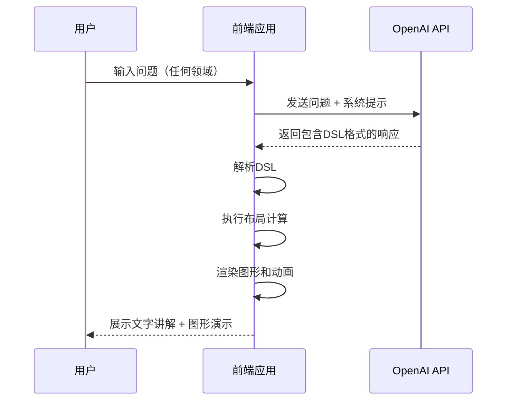
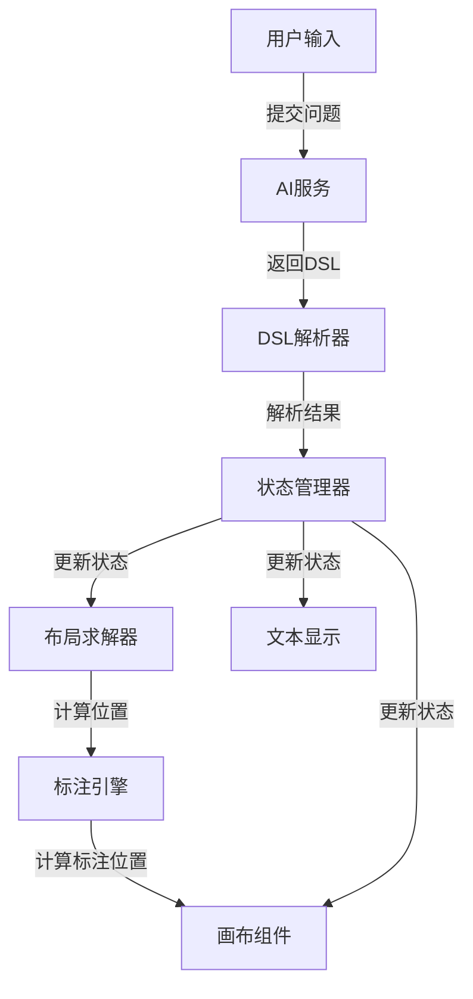

# PChat 技术架构书

## 1. 项目概述

### 1.1 项目背景

随着人工智能技术的快速发展，传统的文字交互方式已经无法满足用户对于复杂概念的理解需求。无论是教育、设计、工程还是日常生活，纯文字回答往往难以直观展示问题的本质和解决过程。用户需要一种更直观、更生动的AI交互方式。

### 1.2 项目目标

本项目旨在开发一个**会边讲边画、动态演示的全领域图形化 ChatGPT**，通过可视化方式增强用户对各种复杂概念的理解，支持用户问任何问题并以图形化方式展示答案。

### 1.3 核心功能

- **全领域支持**：支持用户问任何问题，与ChatGPT一样全面
- **图形化交互**：AI 不仅输出文字，还在画布上绘制图形
- **动态演示**：通过动画、高亮、标注等方式展示过程
- **同步讲解**：文字讲解与图形操作同步进行
- **多轮对话**：支持连续提问，自动处理画布状态
- **智能判断**：AI 自动判断问题是否适合图形化展示，以及使用何种图形
- **多场景适配**：从几何图形到流程图，从数据可视化到概念展示

## 2. 技术栈

### 2.1 前端技术

| 技术/库 | 版本 | 用途 |
|--------|------|------|
| React | 18.x | 前端框架 |
| TypeScript | 5.x | 类型系统 |
| SVG | - | 画布与绘图 |
| Vite | 5.x | 构建工具 |

### 2.2 后端技术

| 技术/服务 | 版本 | 用途 |
|----------|------|------|
| OpenAI API | GPT-4o | AI 推理与生成 |

## 3. 系统架构

### 3.1 整体架构



### 3.2 模块划分

| 模块 | 职责 | 技术实现 |
|------|------|----------|
| 画布管理 | 图形绘制、编辑、状态管理，支持多种图形类型 | SVG |
| 布局引擎 | 智能计算节点位置，支持多种布局类型 | 自定义LayoutSolver |
| 标注引擎 | 处理标注节点的定位和连接 | 自定义AnnotationLayoutEngine |
| AI 交互 | 与OpenAI API通信、DSL解析、智能判断 | OpenAI SDK |
| 动画控制 | 执行动画效果、时间管理 | 自定义动画系统 |
| 状态管理 | 全局状态、用户状态、画布状态 | React useState/useContext |
| 用户界面 | 交互组件、布局管理、多场景适配 | React + TypeScript |

## 4. 前端架构

### 4.1 组件层次

```
App
├── Header
│   ├── Logo
│   ├── Title
│   └── Controls
├── Main
│   ├── CanvasArea
│   │   ├── GraphCanvas (SVG)
│   │   ├── AnimationController
│   │   ├── LayoutSolver
│   │   └── AnnotationLayoutEngine
│   └── ContentArea
│       ├── TextDisplay
│       ├── UserInput
│       │   ├── InputField
│       │   └── SendButton
│       └── ChatHistory
└── Footer
    ├── Status
    └── Settings
```

### 4.2 数据流设计



### 4.3 关键组件

#### 4.3.1 GraphCanvas 组件
- **功能**：使用SVG渲染图形，处理节点和边的绘制
- **属性**：节点数据、边数据、可见性状态、高亮状态
- **方法**：渲染节点、渲染边、渲染时间线事件

#### 4.3.2 LayoutSolver 组件
- **功能**：根据布局类型和约束计算节点位置
- **属性**：布局类型、几何类型、约束条件
- **方法**：solve（计算布局）

#### 4.3.3 AnnotationLayoutEngine 组件
- **功能**：计算标注节点的位置和目标位置
- **属性**：标注偏移量
- **方法**：calculateAnnotationPosition（计算标注位置）、processAnnotations（处理所有标注）

#### 4.3.4 动画控制组件
- **功能**：管理动画序列，控制动画执行
- **属性**：动画队列、执行状态
- **方法**：添加动画、执行动画、暂停动画

## 5. AI 交互流程

### 5.1 交互流程

1. **用户提问**：用户输入任何领域的问题
2. **问题处理**：前端对问题进行预处理，添加系统提示
3. **AI 调用**：向OpenAI API发送请求
4. **智能判断**：AI判断问题是否适合图形化展示，以及使用何种图形
5. **DSL生成**：AI生成包含图形描述的DSL格式响应
6. **DSL解析**：前端解析AI返回的DSL
7. **布局计算**：LayoutSolver计算节点位置
8. **标注处理**：AnnotationLayoutEngine计算标注位置
9. **渲染展示**：在SVG画布上渲染图形和动画

### 5.2 AI 输出格式设计（DSL）

```json
{
  "nodes": [
    {
      "id": "A",
      "label": "A",
      "type": "vertex",
      "x": 200,
      "y": 100
    },
    {
      "id": "B",
      "label": "B",
      "type": "vertex",
      "x": 400,
      "y": 100
    },
    {
      "id": "C",
      "label": "C",
      "type": "vertex",
      "x": 400,
      "y": 300
    },
    {
      "id": "D",
      "label": "D",
      "type": "vertex",
      "x": 200,
      "y": 300
    },
    {
      "id": "rectangle",
      "label": "矩形",
      "type": "annotation",
      "x": 300,
      "y": 50,
      "target": { "nodeId": "A" }
    }
  ],
  "edges": [
    {
      "from": "A",
      "to": "B",
      "label": "AB",
      "type": "straight"
    },
    {
      "from": "B",
      "to": "C",
      "label": "BC",
      "type": "straight"
    },
    {
      "from": "C",
      "to": "D",
      "label": "CD",
      "type": "straight"
    },
    {
      "from": "D",
      "to": "A",
      "label": "DA",
      "type": "straight"
    }
  ],
  "layoutHints": {
    "type": "geometry",
    "geometryType": "rectangle"
  },
  "steps": [
    {
      "text": "首先，我们绘制一个矩形ABCD",
      "add": ["A", "B", "C", "D"],
      "connect": [["A", "B"], ["B", "C"], ["C", "D"], ["D", "A"]]
    },
    {
      "text": "矩形的四个角都是直角",
      "highlight": ["A", "B", "C", "D"]
    }
  ],
  "domain": "mathematics"
}
```

### 5.3 动画执行机制

1. **步骤解析**：解析DSL中的steps数组
2. **动画队列**：将每个步骤的动画效果加入队列
3. **执行器**：按顺序执行动画，控制动画时序
4. **状态同步**：确保文字讲解与图形操作同步进行
5. **错误处理**：处理执行过程中的异常情况

## 6. API 设计

### 6.1 OpenAI API 调用

```typescript
interface OpenAIRequest {
  model: string; // 如 "gpt-4o"
  messages: Array<{
    role: "system" | "user" | "assistant";
    content: string;
  }>;
  temperature: number;
  response_format: {
    type: "json_object";
  };
}

interface OpenAIResponse {
  id: string;
  object: string;
  created: number;
  model: string;
  choices: Array<{
    index: number;
    message: {
      role: string;
      content: string;
    };
    finish_reason: string;
  }>;
  usage: {
    prompt_tokens: number;
    completion_tokens: number;
    total_tokens: number;
  };
}
```

## 7. 数据结构

### 7.1 核心数据模型

#### 7.1.1 节点类型

```typescript
type NodeType = 'vertex' | 'concept' | 'dataPoint' | 'annotation' | 'process' | 'event';

interface Node {
  id: string;
  label: string;
  type?: NodeType;
  x?: number;     // SVG 坐标 X
  y?: number;     // SVG 坐标 Y
  pos?: {         // 位置对象
    x: number;
    y: number;
  };
  size?: {        // 尺寸
    width?: number;
    height?: number;
    radius?: number;
  };
  style?: {       // 样式
    color?: string;
    fill?: string;
    border?: string;
    opacity?: number;
  };
  target?: AnnotationTarget; // 标注目标
}

interface AnnotationTarget {
  type: 'node' | 'edge' | 'angle';
  nodeId?: string;           // 指向的节点ID
  edgeId?: string;           // 指向的边ID，格式 "from-to"
  angleNodes?: string[];     // 三个顶点ID（用于 angle 类型）
  dx?: number;              // X 轴偏移量
  dy?: number;              // Y 轴偏移量
  position?: string;        // 位置：top | bottom | left | right | auto
}
```

#### 7.1.2 边类型

```typescript
type EdgeType = 'straight' | 'arrow' | 'curve' | 'diagonal';

interface Edge {
  from: string;      // 起始节点ID
  to: string;        // 目标节点ID
  label?: string;    // 边标签
  type?: EdgeType;   // 边类型
  style?: {          // 样式
    color?: string;
    width?: number;
    dashed?: boolean;
  };
}
```

#### 7.1.3 布局类型

```typescript
type LayoutType = 'geometry' | 'flow' | 'network' | 'data';

type GeometryType = 'square' | 'triangle' | 'circle' | 'rectangle' | 'polygon';

type ConstraintType = 'equalLength' | 'rightAngle' | 'diagonalIntersect' | 
                      'parallel' | 'perpendicular' | 'group' | 
                      'center' | 'horizontal' | 'vertical' | 'sequential';

interface Constraint {
  type: ConstraintType;
  nodes?: string[];         // 节点 ID 列表
  pairs?: string[][];       // 节点对列表（用于对角线等）
}

interface LayoutHints {
  type?: LayoutType;         // 布局类型
  geometryType?: GeometryType;
  constraints?: Constraint[];
}
```

#### 7.1.4 步骤类型

```typescript
type AnimationType = 'fade' | 'move' | 'scale' | 'draw';

interface Step {
  text: string;              // 讲解文字（必须）
  add?: Node[];              // 新增节点
  connect?: Edge[];         // 建立连线
  remove?: string[];         // 删除节点（节点 ID 列表）
  highlight?: string[];     // 高亮元素（节点 ID 列表）
  animate?: {
    type: AnimationType;     // 动画类型
    target?: string;         // 动画目标
    duration?: number;       // 动画时长（毫秒）
  };
  timeline?: TimelineEvent[]; // 时间线事件（动画数据包）
}

interface TimelineEvent {
  id: string;                          // 事件唯一标识
  from: string;                        // 起始节点 ID（发送方）
  to: string;                          // 目标节点 ID（接收方）
  label?: string;                      // 显示在路径上的标签
  direction?: 'forward' | 'backward'; // 方向（默认 forward）
  color?: string;                      // 事件颜色（默认 #ec4899）
  delay?: number;                      // 延迟毫秒（默认 0）
}
```

#### 7.1.5 DSL 类型

```typescript
interface DSL {
  nodes?: Node[];
  edges?: Edge[];
  layoutHints?: LayoutHints;
  steps?: Step[];
  domain?: string; // 领域：mathematics | software_engineering | physics | general
}
```

### 7.2 状态管理

```typescript
interface AppState {
  // 用户状态
  userInput: string;
  chatHistory: Array<{
    role: 'user' | 'assistant';
    content: string;
    timestamp: number;
  }>;
  
  // 画布状态
  nodes: Map<string, Node>;
  edges: Edge[];
  visibleNodeIds: Set<string>;
  visibleEdgeIds: Set<string>;
  highlightedNodes: Set<string>;
  highlightedEdges: Set<string>;
  
  // 动画状态
  nodeAnimations: Map<string, AnimationType>;
  activeTimelineEvents: TimelineEvent[];
  timelineAnimations: Map<string, { progress: number }>;
  
  // AI 状态
  isLoading: boolean;
  error: string | null;
  currentText: string;
  currentStep: number;
  dsl: DSL | null;
}
```

## 8. 部署与集成方案

### 8.1 前端部署

- **构建工具**：Vite
- **部署平台**：Vercel、Netlify、GitHub Pages
- **构建命令**：`npm run build`
- **预览命令**：`npm run preview`

### 8.2 集成方案

- **本地开发**：`npm run dev`
- **生产环境**：静态部署

## 9. 性能优化

### 9.1 前端优化

- **代码分割**：使用动态导入减少初始加载时间
- **渲染优化**：React.memo、useMemo、useCallback
- **布局优化**：缓存布局计算结果，避免重复计算
- **SVG 优化**：避免不必要的重绘，使用适当的SVG属性

### 9.2 AI 调用优化

- **提示词优化**：精简系统提示，减少token使用
- **响应格式优化**：使用JSON格式，确保解析效率
- **缓存策略**：缓存常见问题的AI响应

## 10. 扩展性考虑

### 10.1 功能扩展

- **多领域支持**：从教育扩展到设计、工程、科普、生活等各个领域
- **支持更多图形类型**：3D图形、图表、流程图、概念图、网络图等
- **增加交互功能**：用户可编辑图形、调整参数、实时修改
- **多语言支持**：国际化文本和图形标注
- **主题定制**：支持不同的视觉风格和领域特定的默认设置
- **智能推荐**：根据用户问题自动推荐合适的图形类型

### 10.2 技术扩展

- **插件系统**：支持第三方工具集成和领域特定插件
- **自定义指令**：允许用户定义绘图指令和领域特定操作
- **多模型支持**：集成其他AI模型，针对不同领域优化
- **离线功能**：本地绘图引擎和基本AI能力
- **API扩展**：开放API，支持与其他系统集成
- **云存储**：支持图形和对话历史的云端存储和分享

## 11. 安全考虑

### 11.1 API 安全

- **API密钥保护**：使用环境变量存储API密钥
- **请求限制**：防止API滥用
- **输入验证**：过滤恶意输入

### 11.2 前端安全

- **XSS防护**：对用户输入进行转义
- **数据加密**：敏感数据加密存储

## 12. 开发计划

### 12.1 阶段划分

| 阶段 | 任务 | 时间估计 |
|------|------|----------|
| 阶段1 | 项目初始化与基础架构 | 1周 |
| 阶段2 | 画布功能实现（SVG） | 2周 |
| 阶段3 | 布局引擎和标注引擎实现 | 1周 |
| 阶段4 | AI交互集成 | 1周 |
| 阶段5 | 动画效果实现 | 1周 |
| 阶段6 | 测试与优化 | 1周 |
| 阶段7 | 部署与上线 | 1周 |

### 12.2 关键里程碑

1. **最小可运行Demo**：实现基本SVG绘图和AI交互
2. **核心功能完成**：实现完整的图形化AI交互流程
3. **性能优化**：确保流畅的动画效果和响应速度
4. **用户体验优化**：改进界面设计和交互体验
5. **正式上线**：部署生产环境，收集用户反馈

## 13. 结论

本技术架构书详细规划了PChat项目的技术实现方案，包括系统架构、模块设计、API接口、数据结构等方面。通过采用React、TypeScript、SVG等现代前端技术，结合OpenAI API的强大能力，我们可以构建一个具有创新性的全领域图形化AI助手，为用户提供更加直观、生动的交互体验。

该架构设计充分考虑了系统的可扩展性、性能优化和安全性，特别强调了布局引擎和标注引擎的设计，为项目的后续开发和维护提供了清晰的指导。通过分阶段实施开发计划，我们可以逐步实现项目目标，最终打造一个功能完善、用户体验优秀的全领域图形化ChatGPT产品。

PChat的创新之处在于它不仅限于特定领域，而是支持用户问任何问题并以边讲边画的方式展示答案，这大大扩展了项目的应用范围和市场潜力。通过合理的技术架构设计和持续的优化，PChat有望成为AI交互领域的创新产品，为用户提供更加直观、生动的AI助手体验。

未来，随着技术的不断进步，PChat可以进一步扩展功能，如支持3D图形、增强现实交互、多模态输入等，为用户提供更加丰富和沉浸式的体验。